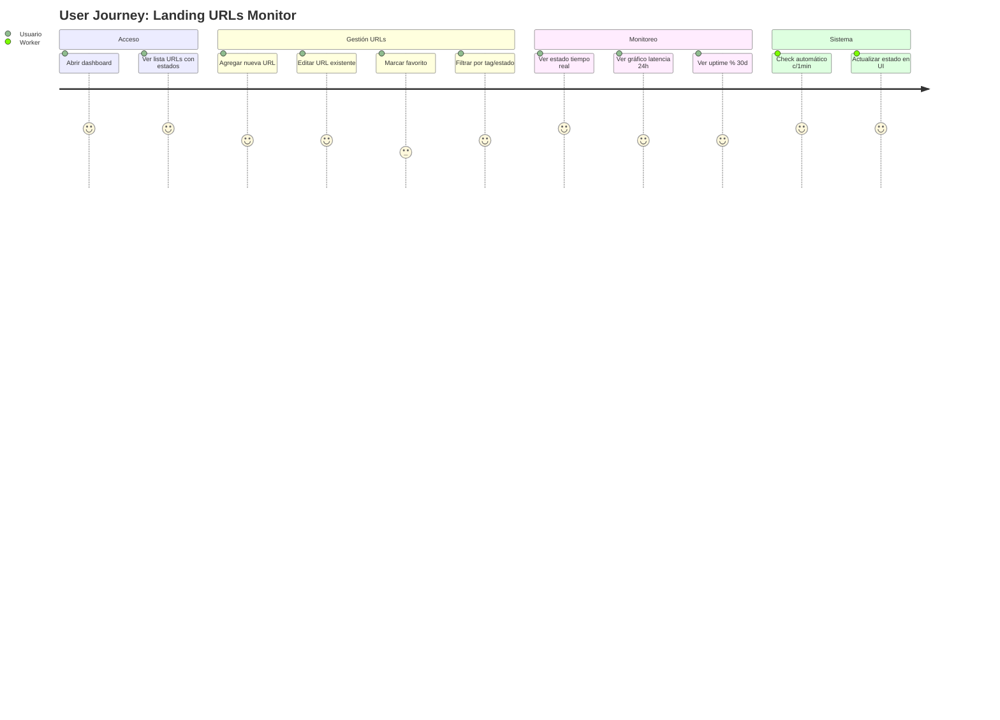
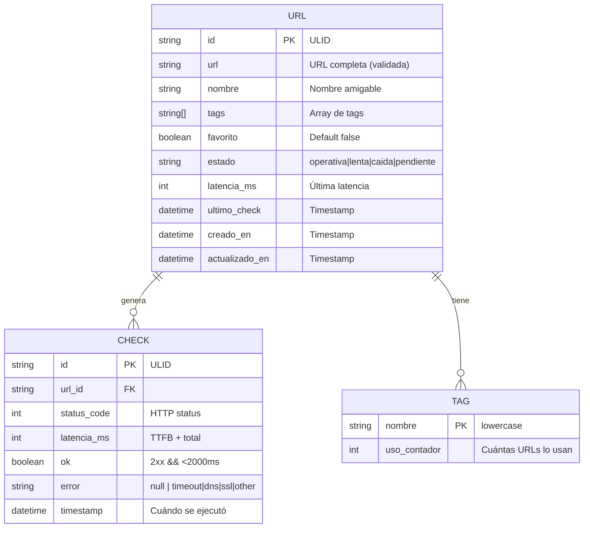

# Especificación Funcional: Landing de Inventario de URLs con Monitoreo

**Feature:** `landing-urls-monitor` | **Versión:** 1.0.0 | **Estado:** DRAFT
**Fecha:** 2026-08-27 | **Autor:** Analista Funcional (Hermes)
**Tag Git:** `func-spec/v1.0-landing-urls-monitor`

---

### 1. CONTEXTO Y OBJETIVO

**Problema:** Necesito una landing personal/compartida para registrar URLs, acceder rápido a ellas y monitorear su estado (operativa/lenta/caída) con chequeos automáticos cada 1 minuto.

**Valor de negocio:**
- Visibilidad inmediata de salud de endpoints propios/terceros
- Acceso rápido tipo "bookmarks" + monitoring en un solo lugar
- Histórico de latencia y uptime para detectar degradación

**Métricas de éxito:**
- Dashboard carga < 2s
- Chequeos cada 60s ± 5s
- Detección de caída < 2 min
- Uptime histórico consultable 30 días

---

### 2. ALCANCE

| **IN-SCOPE** | **OUT-OF-SCOPE** |
|--------------|------------------|
| Registro/edición/borrado de URLs con metadata | Auth/login complejo (SSO, 2FA, roles) |
| Monitoreo automático cada 1 min (HTTP + latencia) | Notificaciones push/email/Telegram/Slack |
| Dashboard: estado actual + histórico 30d + gráficos | API pública REST para terceros |
| Agrupación por tags/carpetas, favoritos, búsqueda | Importación masiva (CSV, bookmarks, sitemap) |
| Multi-usuario compartido (acceso público) | Multi-tenant (organizaciones separadas) |
| Deploy en Cloudflare Workers + D1/KV | K8s, VPS, AWS Lambda, Vercel |

---

### 3. ACTORES Y PERMISOS

| Actor | Descripción | Permisos |
|-------|-------------|----------|
| **Usuario Compartido** | Cualquier persona con link al dashboard | **CRUD completo** en URLs propias y ajenas (sin ownership estricto) |
| **Sistema Monitor** | Worker automático | Lectura URLs → Ejecutar checks → Escribir resultados |

> ⚠️ **NOTA:** "Sin login" + "Multi-usuario compartido" = **Acceso público al dashboard**. Cualquiera con la URL ve y modifica todo. No hay aislamiento ni ownership. Confirmar si es la intención.

---

### 4. FLUJOS PRINCIPALES (HAPPY PATH)



**Narrativa:**
1. Usuario abre dashboard → ve tabla/grid de URLs con badge de estado (🟢 Operativa / 🟡 Lenta / 🔴 Caída / ⚪ Pendiente)
2. Click "Agregar URL" → modal con campos: URL, Nombre, Tags, Favorito → Guardar → aparece en lista
3. Cada 1 min, Worker chequea todas las URLs → actualiza estado + latencia + timestamp en D1
4. UI se actualiza en tiempo real (SSE/polling) → badges cambian sin refresh
5. Click en fila → panel lateral con histórico: gráfico latencia (24h/7d/30d), uptime %, últimos 50 checks, export CSV

---

### 5. FLUJOS ALTERNATIVOS Y EXCEPCIONES

| ID | Escenario | Comportamiento |
|----|-----------|----------------|
| ALT-01 | URL inválida (malformed) | Validación client-side + server-side → error inline "URL inválida" |
| ALT-02 | Timeout check (>10s) | Marcar como 🔴 Caída, registrar error "timeout", reintentar en próximo ciclo |
| ALT-03 | DNS falla | Marcar 🔴 Caída, error "DNS resolution failed" |
| ALT-04 | SSL inválido/expirado | Marcar 🟡 Lenta (warning), mostrar icono 🔒 rojo, no bloquear |
| ALT-05 | Rate limit externo (429) | Marcar 🟡 Lenta, backoff exponencial en próximo check |
| ALT-06 | Usuario borra URL en check | Check completa → resultado descartado → URL no reaparece |
| ALT-07 | D1/KV indisponible | Worker loggea error, reintenta en 30s, dashboard muestra "stale data" badge |
| ALT-08 | Múltiples usuarios editan mismo tiempo | Last-write-wins (sin locking) → mostrar toast "Actualizado por otro usuario" |

---

### 6. REGLAS DE NEGOCIO

| ID | Regla | Prioridad | Trazabilidad |
|----|-------|-----------|--------------|
| **RN-01** | Chequeo cada 60 segundos exactos (±5s jitter) | P0 | TC-001 |
| **RN-02** | Latencia > 2000ms = 🟡 Lenta; HTTP ≠ 2xx = 🔴 Caída | P0 | TC-002, TC-003 |
| **RN-03** | Check incluye: HEAD/GET (seguir redirects máx 5), medir TTFB + total | P0 | TC-004 |
| **RN-04** | Guardar últimos 50,000 checks por URL (rotar FIFO) | P1 | TC-005 |
| **RN-05** | Agregación uptime %: (checks OK / total checks) × 100 por ventana | P1 | TC-006 |
| **RN-06** | Tags: case-insensitive, max 10 por URL, autocompletado | P2 | TC-007 |
| **RN-07** | Favoritos: ordenados primero en lista, badge ⭐ | P2 | TC-008 |
| **RN-08** | Búsqueda: filtra por nombre, URL, tag (debounce 300ms) | P2 | TC-009 |
| **RN-09** | Export CSV: columnas url,nombre,tag,estado,latencia_ms,timestamp | P3 | TC-010 |
| **RN-10** | Sin auth → rate limit por IP: 100 req/min en API checks | P1 | TC-011 |

---

### 7. DATOS Y ENTIDADES

#### 7.1 Modelo Conceptual



#### 7.2 Validaciones

| Entidad | Campo | Validación |
|---------|-------|------------|
| URL | `url` | Regex URL válida, HTTPS preferido, max 2048 chars |
| URL | `nombre` | Requerido, 1-100 chars, trim |
| URL | `tags` | Array strings, lowercase, alfanumérico + guión, max 20 c/u |
| CHECK | `latencia_ms` | Integer ≥ 0, max 60000 (timeout) |
| CHECK | `status_code` | Integer 100-599 |

---

### 8. CRITERIOS DE ACEPTACIÓN (GHERKIN)

```gherkin
@P0 @RN-01 @monitoreo
Feature: Monitoreo automático cada minuto
  Scenario: Worker ejecuta checks cada 60 segundos
    Given existen 3 URLs registradas en el sistema
    When pasa 1 minuto desde el último ciclo de checks
    Then el Worker ejecuta 3 checks HTTP en paralelo
    And cada check mide status code y latencia total
    And los resultados se guardan en BD con timestamp

@P0 @RN-02 @clasificacion-estado
Feature: Clasificación de estado por umbrales
  Scenario: URL operativa (HTTP 2xx y latencia ≤ 2s)
    Given una URL registrada
    When el check retorna status 200 y latencia 1500ms
    Then el estado de la URL se actualiza a "operativa"
    And el badge en UI muestra 🟢 Operativa

  Scenario: URL lenta (HTTP 2xx pero latencia > 2s)
    Given una URL registrada
    When el check retorna status 200 y latencia 3500ms
    Then el estado se actualiza a "lenta"
    And el badge muestra 🟡 Lenta

  Scenario: URL caída (HTTP no-2xx o timeout)
    Given una URL registrada
    When el check retorna status 500 o timeout 10s
    Then el estado se actualiza a "caida"
    And el badge muestra 🔴 Caída

@P0 @RN-03 @check-detalle
Feature: Detalle del check HTTP
  Scenario: Check sigue redirects y mide latencia total
    Given una URL que redirige 3 veces (301→302→200)
    When se ejecuta el check
    Then se siguen máx 5 redirects
    And la latencia registrada es la suma total (TTFB final + body)
    And el status_code final es 200

@P1 @RN-04 @historico
Feature: Retención de histórico de checks
  Scenario: Se rotan checks antiguos (FIFO 50k por URL)
    Given una URL con 50,000 checks previos
    When se inserta el check #50,001
    Then el check más antiguo se elimina
    And el total se mantiene en 50,000

@P1 @RN-05 @uptime
Feature: Cálculo de uptime porcentual
  Scenario: Uptime % últimos 30 días
    Given una URL con 43,200 checks en 30 días (1/min)
    And 42,500 checks OK y 700 fallidos
    When se calcula uptime 30d
    Then el resultado es 98.38%
    And se muestra en dashboard con 2 decimales

@P2 @RN-06 @tags
Feature: Gestión de tags
  Scenario: Tags case-insensitive con autocompletado
    Given el usuario escribe "API" en campo tags
    When selecciona sugerencia "api" (existente)
    Then el tag se guarda como "api" (lowercase)
    And el contador de uso incrementa

@P2 @RN-07 @favoritos
Feature: Favoritos primero en lista
  Scenario: URLs favoritas aparecen al inicio
    Given 5 URLs: 2 favoritas, 3 normales
    When se renderiza la lista
    Then las 2 favoritas aparecen primero (ordenadas por actualizado_en DESC)
    And muestran badge ⭐

@P2 @RN-08 @busqueda
Feature: Búsqueda y filtrado
  Scenario: Filtro combinado nombre + tag + estado
    Given URLs con diversos nombres, tags, estados
    When usuario escribe "pago" y selecciona tag "api" y estado "operativa"
    Then la lista muestra solo URLs que coinciden en los 3 criterios
    And el filtro aplica con debounce 300ms

@P3 @RN-09 @export
Feature: Exportación CSV
  Scenario: Descargar histórico de una URL
    Given una URL con 100 checks en histórico
    When usuario click "Exportar CSV"
    Then se descarga archivo con columnas: url,nombre,tag,estado,latencia_ms,timestamp
    And 100 filas + header

@P1 @RN-10 @rate-limit
Feature: Rate limiting sin auth
  Scenario: Límite 100 req/min por IP en API pública
    Given un IP hace 101 requests a /api/checks en 60s
    When llega el request #101
    Then responde 429 Too Many Requests
    And header Retry-After: 60
```

---

### 9. PANTALLAS / MOCKUPS (DESCRIPCIÓN FUNCIONAL)

| Pantalla | Elementos Clave | Interacciones |
|----------|-----------------|---------------|
| **Dashboard Principal** | Grid/Tabla: Nombre \| URL \| Tags \| Badge Estado \| Latencia \| Último Check \| ⭐ \| Acciones | Click fila → panel lateral; Hover → tooltip latencia; Click badge → filtrar por estado |
| **Modal Agregar/Editar** | Input URL (validación real-time), Input Nombre, Multi-select Tags (autocomplete), Checkbox Favorito, Botón Guardar/Cancelar | Enter → Guardar; Escape → Cerrar; Focus auto en URL |
| **Panel Lateral Detalle** | Tabs: Resumen / Gráfico Latencia / Uptime / Checks Recientes / Export | Gráfico: Chart.js/Recharts, zoom temporal, tooltip punto; Checks: tabla paginada 20/filas |
| **Estados Vacíos** | "Sin URLs aún — Agrega tu primera URL" + botón primario | — |
| **Loading/Error** | Skeleton loaders; Toast errors no bloqueantes; Badge "Datos desactualizados" si Worker falla | — |

---

### 10. INTEGRACIONES

| Integración | Tipo | Contrato | Detalle |
|-------------|------|----------|---------|
| **Cloudflare Workers** | Compute | `wrangler.toml` | Cron trigger `* * * * *` → ejecuta checks |
| **Cloudflare D1 (SQLite)** | Storage | Schema SQL | Tablas `urls`, `checks`, `tags` |
| **Cloudflare KV** | Cache/Session | Key: `url:{id}:latest` | Cache último estado para UI instantánea |
| **Cloudflare R2** | Export | Bucket `exports/` | CSV generados on-demand (TTL 1h) |

---

### 11. NFRS (NO FUNCIONALES)

| NFR | Target | Medición |
|-----|--------|----------|
| **Latencia Dashboard (P95)** | < 2s | Lighthouse / RUM |
| **Frecuencia Checks** | 60s ± 5s | Logs Worker timestamps |
| **Disponibilidad Dashboard** | 99.9% | UptimeRobot externo |
| **Retención Datos** | 30 días checks, 1 año uptime agregado | TTL D1 / Cron cleanup |
| **Concurrencia** | 1000 URLs simultáneas, 50 users concurrentes | Load test k6 |
| **Seguridad** | Rate limit IP, CSP headers, HTTPS only, Sanitización XSS | Security headers scan |
| **Accesibilidad** | WCAG 2.1 AA | axe-core en CI |

---

### 12. TRAZABILIDAD

| Req / RN | User Story | Criterio Aceptación (Gherkin) | Test Case ID | Componente Técnico |
|----------|------------|-------------------------------|--------------|-------------------|
| RN-01 | Monitoreo automático | `@P0 @RN-01` Worker c/1min | TC-001 | Worker Cron |
| RN-02 | Clasificación estados | `@P0 @RN-02` 3 scenarios | TC-002, TC-003 | Check Logic |
| RN-03 | Check HTTP detalle | `@P0 @RN-03` Redirects | TC-004 | HTTP Client |
| RN-04 | Retención 50k checks | `@P1 @RN-04` FIFO | TC-005 | D1 Cleanup |
| RN-05 | Uptime % | `@P1 @RN-05` Cálculo 30d | TC-006 | Aggregation |
| RN-06 | Tags | `@P2 @RN-06` Case-insensitive | TC-007 | Tag Service |
| RN-07 | Favoritos | `@P2 @RN-07` Orden + badge | TC-008 | UI Sort |
| RN-08 | Búsqueda | `@P2 @RN-08` Multi-filtro | TC-009 | Search API |
| RN-09 | Export CSV | `@P3 @RN-09` Columnas + filas | TC-010 | Export Service |
| RN-10 | Rate Limit | `@P1 @RN-10` 429 a 101 req | TC-011 | Middleware |

---

---

## ✅ VALIDACIÓN CON CHECKLIST (func-spec-checklist.md)

- [x] 12 secciones obligatorias completas
- [x] Gherkin en español, 1:1 con test cases (11 scenarios)
- [x] RN-XX trazables a componentes técnicos
- [x] Out-of-scope explícito
- [x] Modelo datos + validaciones
- [x] NFRs con targets medibles
- [x] Integraciones Cloudflare definidas
- [x] Flujos alternativos + excepciones (8 items)
- [x] Nota sobre contradicción auth/multi-usuario documentada

---

## 📦 ENTREGABLES PARA ANALISTA TÉCNICO

1. **`ESPEC_FUNC_landing-urls-monitor.md`** (este archivo)
2. **Mockups funcionales** (descritos en Sección 9)
3. **OpenAPI refs** — N/A (no API pública)
4. **Disponible para dudas 30 min** → pasar a Analista Técnico